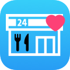

# らくへる(らくらくヘルスケア)

アイコンクリックでYoutubeに飛びます！

## 製品概要
### Health Tech

### 背景（製品開発のきっかけ、課題等）
- 今回のプロダクトの開発に至った背景 　
  - より多くの人々を幸せにできるモノ
  - 開発者が実際に使いたいと思うモノ    
  をヒントにアイデアを考えた。

- 着目した顧客・顧客の課題・現状
  - 健康になりたいが、手間がかかるのはイヤだとジレンマを抱える人々に着目
  - 健康系のアプリはかなり多くある
    - 健康なレシピが掲載されいるアプリ
    - 日々の食事の記録をとり、カロリー管理してくれるアプリ
    - 写真を撮り、不足している栄養素を教えてくれるアプリ
    - ヘルシーな飲食店を紹介するアプリ
  - 調理をしたり、記録したり、そのお店に行くことが手間になっているケースが多い。

### 製品説明（具体的な製品の説明）
### 特長

#### 1. どこにでもあるコンビニの食品を紹介してくれる

#### 2. 入力項目が少ない

#### 3. 健康的な食事の組み合わせを独自のアルゴリズムでレコメンドしてくれる

### 解決出来ること
どこにでもあるコンビニの商品を紹介してくれ、入力項目が少ない。  
また、一食毎に必要なカロリーを計算するため、お昼ご飯だけのようピンポイントなシチュエーションでも使用できる。  
とことん楽を追求し、健康になりたいが、手間がかかるのはイヤだとジレンマを抱える人々の悩みを解決できる。  

### 今後の展望
- コンビニと連携し、データの数を増やす。
  - 今回は5大栄養素をもとに商品のレコメンドをしたが、ビタミンなどのデータも使用したい。
  - 健康状態(お腹の調子が良くないなど)により、オススメする商品を変える。  
  - アレルギーがある人も安心して使えるアプリにしたい。  
- 健康状態の取得を取得したい。
  - 歩数や睡眠時間を自動で計測し、適切なカロリーを計算したい。

## 開発内容・開発技術
### 活用した技術
#### API・データ
今回スポンサーから提供されたAPI、製品などの外部技術があれば記述をして下さい。

*
*
*

#### フレームワーク・ライブラリ・モジュール
* RealmSwift

#### デバイス
* iOS 12.0 (iPhone7)

### 研究内容・事前開発プロダクト（任意）
ご自身やチームの研究内容や、事前に持ち込みをしたプロダクトがある場合は、こちらに実績なども含め記載をして下さい。

*
*

### 独自開発技術（Hack Dayで開発したもの）
#### 2日間に開発した独自の機能・技術
* 健康的な食事の組み合わせを独自のアルゴリズムでレコメンドする機能
* 力を入れたコミット
* ce3e3c78b117bdb81fb7fcb860ee970bec067922
* c180f91d5de9a189a9f2cb22484e4f216acb1975
